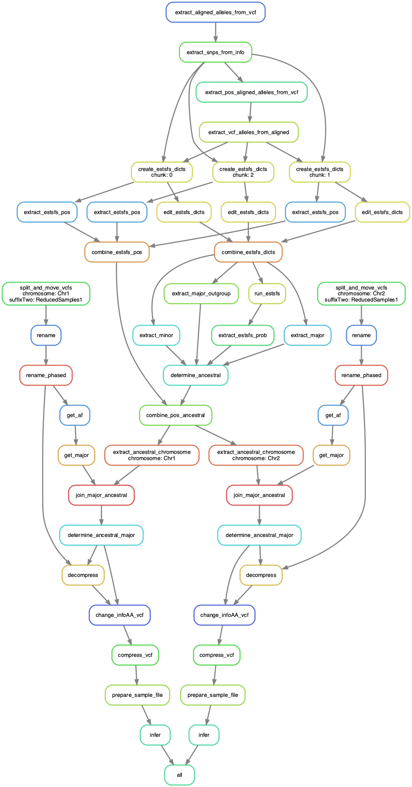

# README Snakemake Tree sequence pipeline


# How to run this pipeline on Eddie
1. (If not done yet) Configure conda by
   Adding the environment directory (read more about it here, also check for updates: https://www.wiki.ed.ac.uk/display/ResearchServices/Anaconda):
   ```
   module load anaconda
   conda config --add envs_dirs /exports/cmvm/eddie/eb/groups/HighlanderLab/anaconda/envs
   ```

   And adding the pkg directory:
   `conda config --add pkgs_dirs /exports/cmvm/eddie/eb/groups/HighlanderLab/anaconda/pkg`

   Make sure your `~/.condarc` contains the following lines:
   ```
   envs_dirs:
    - /exports/cmvm/eddie/eb/groups/HighlanderLab/anaconda/envs
   pkgs_dirs:
    - /exports/cmvm/eddie/eb/groups/HighlanderLab/anaconda/pkg
   ```
3. Add drmaa path to your `~/.bash_profile` or equivalent:
   `export DRMAA_LIBRARY_PATH=/exports/applications/gridengine/ge-8.6.5/lib/lx-amd64/libdrmaa.so`

On Eddie do
```
# Initiate an interactive login
qlogin -l h_vmem=32G

# load anaconda and activate snakemake environment
module load anaconda/5.3.1
conda deactivate # there should be no (env) in your prompt!
conda activate snakemake

# Go to your workspace
cd path/to/your/workspace

# clone this
git clone https://github.com/HighlanderLab/tree_seq_pipeline.git
cd tree_seq_pipeline

# Create a config file for you dataset. You can use `Snakemake/config/beetest.yaml` as a template.
- change o_dir to a location in your workspace (this is the place where the output folder is going to be created)
- change vcf_dir to the folder where your input vcfs are stored (and ancestral inference input, if required)
- all other paths are relative to vcf_dir
- change meta to the (relative) path where your metafile is stored
- change ancestralAllele to the (relative) path where your ancetralfile is stored

# pipeline is executed from the workflow folder
cd Snakemake/workflow

# for interactive use
snakemake -j 1 --use-conda -n --configfile path/to/config.yaml # for a dry run
snakemake -j 1 --use-conda --configfile path/to/config.yaml # real run
snakemake -j 1 --use-conda -F --configfile path/to/config.yaml # force run (overwrites existing outputs)

# to submit to cluster use
# N = number of chromosomes (so they run in parallel)
snakemake -j N --use-conda --configfile path/to/config.yaml --drmaa " -l h_vmem=32G" --jobscript jobscript.sh &
snakemake -j N --use-conda --configfile path/to/config.yaml --drmaa " -l h_vmem=32G" --jobscript jobscript.sh -F &

# the commands listed here are only an example.
# the --drmaa flag takes the same inputs as qsub, in that way, other options can be use in addition to -l h_vmem.
```

# Test data
A test data set is now included within the repo in: `TestDataBee/`  

The folder contains:
* a `RawVCF` folder containing a combined VCF file and its index
* seed for SFS estimation -- `seedfile.txt`
* an alignment with an outgroup species for ancestral allele inference -- `testAligned.txt`
* sample metadata -- `SampleMetaData.csv`
* config file for SFS estimation -- `config-kimura_3o.txt`

## Running the pipeline on the bee test data
- copy/clone this repo into your Eddie working space
- inside `Snakemake/workflow` (where the `Snakefile` is located), run: `snakemake -j 1 --use-conda -F --configfile ../config/beetest.yaml`

# Important notes
- you can run snakemake in interactive mode or through submitting to the cluster (both need to be performed through the login node for now). When submitting, the jobs still get submit one after the other (according to dependencies), hence the process needs to stay open. You can use either `screen` (https://www.wiki.ed.ac.uk/display/ResearchServices/Bioinformatics#Bioinformatics-Loginnode) or & (not tested yet).

# About config files
Snakemake config files are in YAML format. You can specify multiple config files for a run if desired. This can be hardcoded inside the Snakefile. But it is more flexible to specify configfiles on the commandline via `--configfile`. You can also supply individual key-value pairs on the command line using `--config`, this takes priority over what's stated the config file(s). Useful, e.g., to change the output directory `--config o_dir="../../myOutputDir"`.

## Description of the config files
We used to have two config files the contents of which are described below. Both are merged in the bee example (see `Snakemake/config/beetest.yaml`) Important settings are:
- `PROJECT`: the name of the project and the output folder
- `o_dir`: the directory inside which the project directory is going ot be created
- `process_vcf_in_original_dir`: whether or not to process the VCFs in the original directory, `true` or `false`
- `species`: which species are you working with
- `ploidy`: ploidy of the organism
- `noChromosomes`: the number of chromosomes (we might want to change this to names)
- `vcf_dir`: the path to the VCF files. Within this directory, you need to have a folder "RawVCF" with **all** raw VCF files. Additionaly, the pipeline will create one folder per chromosome in this folder to store processed data (unless ). *All other files and paths are intepreted as relative path starting at this location*.
- `bcftoolsModule` and `vcftoolsModule`: the module names on Eddie - they two are not used at the moment but could be used via envmodules command
- `ancestralAllele`: the relative path to the file with ancestral allele information (for the format, see below)
- `meta`: relative path to the meta file (for the format, see below)
- `chromosome_length`: a list with chromosome length in base pairs for each chromosome (must be numerical chromosome names for now)

All the following file paths are relative to the vcf_dir set in `vcf_dir` above:  
- `raw_vcf`: "RawVCF/Combined_ReducedSamples1.vcf.gz"
- `aligned_focal`: "testAligned.txt"
- `no_estsfs_chunks`: 3
- `estsfs_config`: "config-kimura_3o.txt"
- `estsfs_seed`: "seedfile.txt" 

Tsinfer parameters (these here work for bee):  
- `tsi_threads`: 20
- `tsi_lwertime`: 0.0 # bee test data
- `tsi_uprtime`: 0.1 # bee test data
- `tsi_lenmultiply`: 2
- `tsi_recombratio`: 1.1e-8
- `tsi_mismtachratio`: 1

# Description of rules and workflow

1. Split snakemake file
INPUT: You can start with files that are already split or files that are still combined (meaning, all genome in one VCF). We do require the files to be named a certain way.
* files that are already split = Chr{N}_{whatever}.vcf.gz
* files that are still combined = Combined_{whatever}.vcf.gz

The input VCF files must also be compressed and indexed!

RULES:
* `rule move_vcf`: if all the files are already split, it just moves the VCFs to their corresponding chromosome folder created within the config['vcfdir]
* `rule split_move_vcf`: if there are any combined files, it splits them and puts the split files to their corresponding chromosome folder created within the config['vcfdir]

OUTPUT: The rule creates a folder for each chromosome under the config['vcfdir'] directory. Within each folder, there are split files from each of the input files.

2. Merge_samples_vcf snakemake file
INPUT: The input are the split VCF files created by the split snakemake file. That means, there is one folder per chromosome under config['vcfdir'] that includes all the VCFs for that chromosome.

RULES:
If there is more than one file to start with, then files need to be merge into one VCF:
* `rule get_samples`: extract the sample names from all the files
* `rule compare`: takes all .txt files at once, compare and remove duplicates, and write a new temporary .txt for each one. Then, it filters the VCF files to remove the duplicated samples
* `rule merge`: merges all the files within a chromosome file into a final Chr<N>_final.vcf.gz and puts in the config['vcfdir] directory

If there is only one file to start with, there is nothing to merge and this file just needs to be renamed.
* `rule rename`: renamed the vcf tofinal Chr<N>_final.vcf.gz and puts in the config['vcfdir'] directory

OUTPUT: A single vcf per chromosome with all the samples named Chr<N>_final.vcf.gz in the config['vcfdir] directory and its index file

3. Prepare_files_for_tsinfer snakemake file
INPUT: The final files split by chromosome from the merge rule AND a file with ancestral allele information. The ancestral file has to have chr_pos and AA, split with a tab.

RULES:
* `rule get_af`: computes the AN (total number of alleles in called genotypes), AF (allele frequency for each alternative allele), and AC (allele count), and extracts the INFO from the vcf file (this can take a long time!!!)
* `rule get_major`: extracts the major allele from the INFO file created in the previous step
* `rule decompress`: decompresses the VCF so that we can add the ancestral/major info within the file
* `rule extract_vcf_pos`: Extracts the positions of SNPs from the VCF to later match with the ancestral allele info (format CHR_POS)
* `rule match_ancestral_allele`: For each position in the VCF, determined the ancestral allele - if this one is missing, then the major allele is considered ancestral.
* `rule change_infoAA_vcf`: puts the information about the ancestral (or major) allele into the VCF to speed out the reading into python and preparing the tsinfer .samples file. It adds the info line explaining the AA (ancestral allele) and then replaces the INFO column with information about the ancestral/major allele

OUTPUT: One VCF per chromosome Chr<N>_ancestral.vcf.gz in the config['vcfdir'] with the added ancestral information and its index file

4. Phasing snakemake file
INPUT: The VCF with the ancestral information from the previous snakemake file, and a genetic (recombination map).

RULES:
If the ploidy is 1, that we don't have to phase the file:
* `rule rename_phased`: rename the VCF with the ancestral info to the final phased file

If the ploidy is more than 1, than the files need to be phased:
* `rule phase`: uses shapeit4 to phase by chromosome

OUTPUT: One VCF per chromosome Chr<N>_phased.vcf.gz in the config['vcfdir'] with the added ancestral information and its index file

5. Infer_trees snakemake file
INPUT: One phased VCF file per chromosome with ancestral information AND the file with the meta information about the samples. The meta files must be comma separated file with four columns (some can be empty): "ID", "Pop", "SubPop", and "Time".

RULES:
* `rule prepare_samples_file`: Takes the vcf file, the meta file, the chromosome length from config['chrLength'] and ploidy from config['ploidy']. If the ploidy is 1, it does not check for the phasing of the samples. If ploidy is 2, it requires the VCF to be phased (| in the genotype field instead of /)
* `rule infer`: takes the samples file prepared in the previous step to infer one tree sequence per chromosome.

OUTPUT: The output is one tree sequence for each chromosome in the ../Project/Tsinfer/trees directory.


NOTE:
We chose to work with conda environments. Currently, we are using the following environments:
* bcftools: contains bcftools and bcftools
* HLab_tsinfer: contains snakemake and tsinfer dependencies

An alternative to using the conda environment is to load envmodules through (only for Eddie modules)

# envmodules:
    #     config['bcftoolsModule']


# DAG
The specific workflow DAG daw will depend on the input files and config. Here is one example, starting with a combined (i.e., multi-chromosome) VCF file:  

